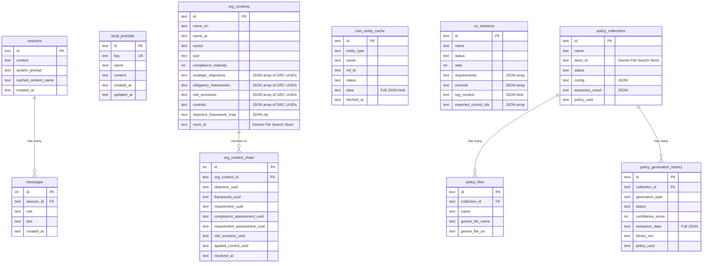

# WathbahGRC Admin — ERD (Text)
**Snapshot taken:** 2026-04-14
**Commit / branch:** a03a947 / db-scheme-changes
**Scope of this file:** Plain-text ER diagram of the local SQLite tables.

## Notes

- Most "relationships" between this app and GRC entities are via UUID strings stored in JSON arrays, not via foreign keys.
- The `org_context_chain` table is a denormalized join table that materializes the full path: Objective → Framework → Requirement → ComplianceAssessment → RequirementAssessment → RiskScenario → AppliedControl.
- The `ciso_entity_cache` table is a local TTL cache (30 min) of GRC API responses, keyed by `(id, entity_type)`.
