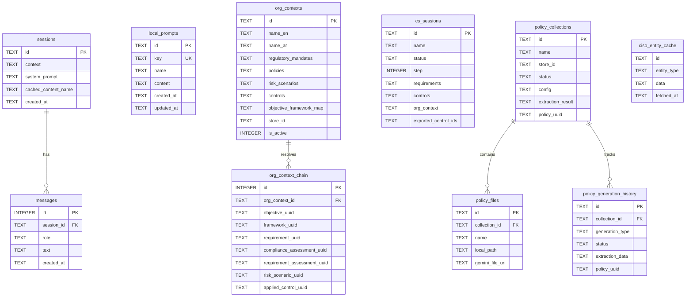

# WathbahGRC Admin — ERD (Text)
**Snapshot taken:** 2026-04-15
**Commit / branch:** dev-version @ 0b0e7a0
**Scope of this file:** Plain-text ER diagram of local SQLite tables and their key external references.

## External References (not in local DB)

The following UUIDs in `org_context_chain` and `ciso_entity_cache` reference entities in the **main WathbahGRC** PostgreSQL database:

- `framework_uuid` → WathbahGRC `Framework`
- `requirement_uuid` → WathbahGRC `RequirementNode`
- `compliance_assessment_uuid` → WathbahGRC `ComplianceAssessment`
- `requirement_assessment_uuid` → WathbahGRC `RequirementAssessment`
- `risk_scenario_uuid` → WathbahGRC `RiskScenario`
- `applied_control_uuid` → WathbahGRC `AppliedControl`
- `objective_uuid` → WathbahGRC `OrganisationObjective`

## Muraji API Objects (not in local DB)

Questions, typical evidences, and admin notes on requirement nodes are stored as JSON properties within Muraji library documents, not in local SQLite tables. See `02-data-model/requirement-node-and-children.md`.
